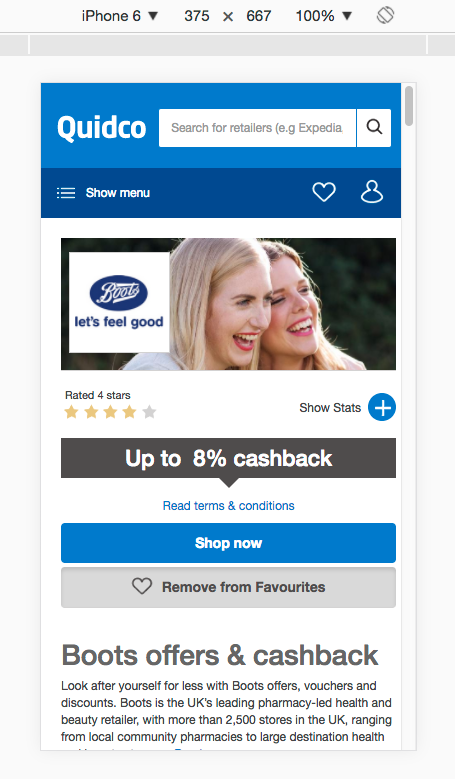
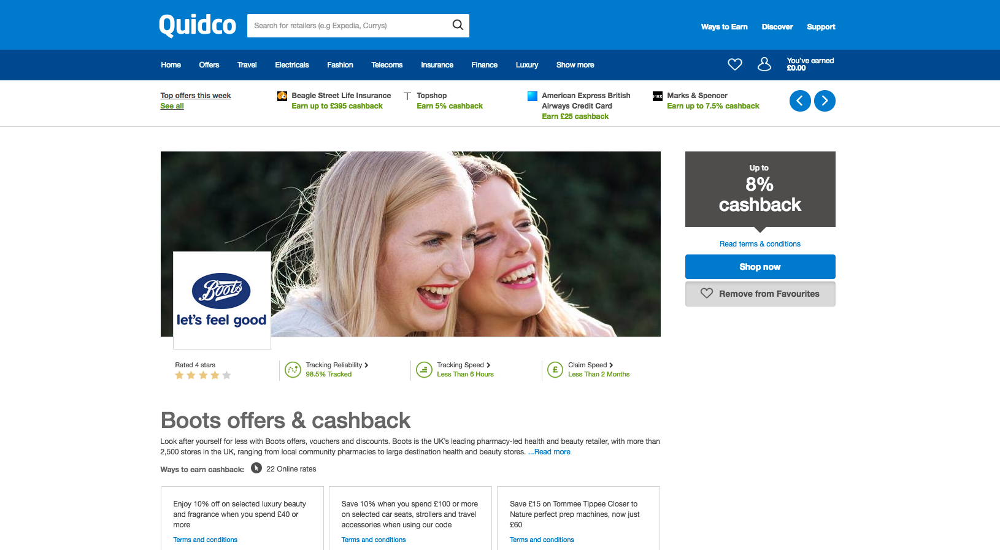

# Quidco :boom:
## retailPageOffers ®

### Obj: to move offers grid up the page above the fold to promote further engagement.      

#### 1.Variation (Prominent offers page)       
    
#### 3. Devices    
    - Desktop    
    - Table   
    - Mobile    
#### 4. Browsers    
    - Chrome 45+    
    - Firefox 45+    
    - IE9+    
#### 5. Other:     
   Logged in users ONLY.     

 
  
 <kbd>mobile :notebook:</kbd> :mag:        
 
 
 
 
  
 
  
 <kbd>desktop :notebook:</kbd> :mag:        
 

functionality checked:
- carousel by top navigation :ok:
- carousel for similar retailers :ok:
- adverb under menu does not work 
- terms and conditions popup for grid :ok:
- list mouse over :ok:
- stats popup :ok:
- remove/add favorite CTA :ok:
- remove/add favorite grid panel :ok:
- remove/add CTA/Panel working together :ok:
- above footer adverb sticks out under 320px - control and variation1
- cookie for boots only atm :ok:

